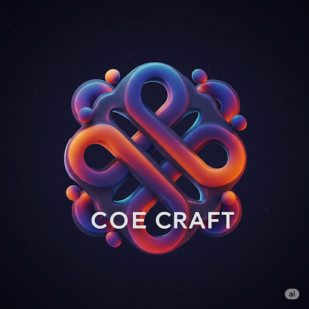

# Code Craft 🚀


<div align="center">
  
  <h3>A modern online code editor and compiler platform</h3>
</div>

## 📋 Table of Contents

- [Features](#-features)
- [Tech Stack](#-tech-stack)
- [Project Structure](#-project-structure)
- [Environment Variables](#-environment-variables)
- [Getting Started](#-getting-started)
- [User Guide](#-user-guide)
- [For Developers](#-for-developers)
- [Authentication](#-authentication)
- [Database Schema](#-database-schema)
- [API Documentation](#-api-documentation)
- [Deployment](#-deployment)
- [Contributing](#-contributing)
- [License](#-license)
- [Security](#-security)
- [Support](#-support)

## ✨ Features

Code Craft is a comprehensive online coding platform with the following features:

### 🌐 Multi-Language Support

- **15+ Programming Languages**: Python, JavaScript, TypeScript, Java, C++, Ruby, Go, C#, Swift, Rust, and more
- **Real-time Syntax Highlighting**: Monaco Editor with language-specific highlighting
- **Intelligent Autocompletion**: Language-aware code suggestions

### 🛠️ Code Execution Environment

- **Secure Sandboxed Execution**: Run code safely in isolated containers
- **Multiple Runtime Environments**: Support for various language versions
- **Real-time Output Display**: See results as your code executes
- **Error Handling and Debugging**: Detailed error information and debugging tools

### 🧠 Intelligent Features

- **AI-powered Code Assistance**: Get suggestions and solutions from our AI assistant
- **Natural Language Explanations**: Ask questions about your code in plain English
- **Image Generation**: Create visualizations with the `@image` command
- **Voice Commands**: Control the editor with your voice

### 📊 Code Sharing & Collaboration

- **Instant Code Snippet Sharing**: Generate shareable links in one click
- **Code Comments and Discussions**: Add context and discuss code with others
- **Version History**: Track changes to your code over time
- **Stars**: Bookmark favorite code snippets for future reference

### 🎨 Modern Development Experience

- **VS Code-like Interface**: Familiar editor experience
- **Multiple Themes**: Choose from light, dark, and custom themes
- **Customizable Editor Settings**: Tailor your coding environment
- **Responsive Design**: Perfect on desktop and mobile devices

### ⭐ Pro Features

- **Extended Runtime Limits**: Run computationally intensive code
- **Priority Code Execution**: Skip the queue
- **Advanced AI Features**: Enhanced AI assistance
- **Private Snippets**: Keep your code confidential
- **Custom Themes**: Create your own editor themes
- **API Access**: Integrate with your own applications

## 🔋 Tech Stack

Code Craft is built with a modern, scalable technology stack:

- **Frontend**: 
  - Next.js 15+ with App Router
  - React 19
  - TypeScript
  - Tailwind CSS

- **Backend**:
  - Convex for database and backend functions
  - Node.js

- **Authentication**:
  - Clerk for user management and authentication

- **Database**:
  - Convex database (serverless)
  - Redis for caching and session management

- **Code Execution**:
  - Secure containerized environments

- **Editor**:
  - Monaco Editor (same as VS Code)

- **AI**:
  - Google Gemini API for AI assistance
  - Hugging Face for image generation

- **Payments**:
  - Stripe integration

## 📁 Project Structure

The Code Craft codebase is organized as follows:

### Root Files

| File | Description |
|------|-------------|
| `next-env.d.ts` | TypeScript declarations for Next.js |
| `next.config.ts` | Next.js configuration file |
| `package.json` | Project dependencies and scripts |
| `postcss.config.mjs` | PostCSS configuration for Tailwind |
| `README.md` | Project documentation (this file) |
| `SECURITY.md` | Security policy and vulnerability reporting |
| `tailwind.config.ts` | Tailwind CSS configuration |
| `tsconfig.json` | TypeScript compiler configuration |
| `LICENSE` | MIT license file |

### `/convex` - Backend API and Database

The `convex` directory contains all the server-side logic:

| File/Directory | Purpose |
|----------------|---------|
| `auth.config.ts` | Authentication configuration for Convex |
| `codeExecutions.ts` | Code execution service integration |
| `http.ts` | HTTP endpoints for webhooks (Stripe, Clerk) |
| `lemonSqueezy.ts` | LemonSqueezy payment integration |
| `schema.ts` | Database schema definition |
| `snippets.ts` | Code snippet CRUD operations |
| `stripe.ts` | Stripe payment processing |
| `users.ts` | User management functions |
| `_generated/` | Auto-generated Convex type definitions |

### `/public` - Static Assets

Contains all static files served by Next.js:

| File | Purpose |
|------|---------|
| `code-craft.png` | Main application logo |
| `bash.png`, `cpp.png`, etc. | Programming language icons |
| `vercel.svg` | Vercel deployment logo |
| Various language icons | Icons for supported programming languages |

### `/src` - Application Source Code

The main application code organized by feature:

#### `/src/app` - Next.js App Router

| Directory | Description |
|-----------|-------------|
| `(root)/` | Home page and main editor components |
| `api/` | API routes for AI chat and other services |
| `docs/` | Documentation pages |
| `pricing/` | Subscription plans and payment UI |
| `privacy/` | Privacy policy page |
| `profile/` | User profile page |
| `snippets/` | Code snippets browsing and viewing |
| `support/` | User support and FAQ page |
| `terms/` | Terms of service page |

#### Key Frontend Components

| Directory | Purpose |
|-----------|---------|
| `src/components/` | Reusable UI components |
| `src/hooks/` | Custom React hooks |
| `src/store/` | Global state management |
| `src/types/` | TypeScript type definitions |
| `src/utils/` | Utility functions |

#### Notable Files

| File | Purpose |
|------|---------|
| `src/middleware.ts` | Next.js middleware for authentication |
| `src/app/globals.css` | Global CSS styles |
| `src/app/layout.tsx` | Root layout component |
| `src/app/api/ai-chat/route.ts` | AI chat backend implementation |
| `src/components/AiChatSidebar.tsx` | AI assistant sidebar UI |
| `src/utils/imageGeneration.ts` | AI image generation |
| `src/utils/redis.ts` | Redis client for caching |

## 🔐 Environment Variables

Code Craft requires the following environment variables:

### Authentication (Clerk)

```
NEXT_PUBLIC_CLERK_PUBLISHABLE_KEY=pk_test_***
NEXT_PUBLIC_CLERK_DOMAIN=your-domain.clerk.accounts.dev
CLERK_SECRET_KEY=sk_test_***
CLERK_WEBHOOK_SECRET=***
```

### Database (Convex)

```
CONVEX_DEPLOYMENT=dev:your-deployment-id
NEXT_PUBLIC_CONVEX_URL=https://your-deployment-id.convex.cloud
```

### Payments (Stripe)

```
STRIPE_SECRET_KEY=sk_test_***
STRIPE_PUBLISHABLE_KEY=pk_test_***
STRIPE_WEBHOOK_SECRET=whsec_***
STRIPE_PRICE_ID=price_***
NEXT_PUBLIC_APP_URL=http://localhost:3000
```

### AI Services

```
GEMINI_API_KEY=***
HUGGINGFACE_API_KEY=***
```

### Redis Cache

```
REDIS_URL=rediss://your-redis-url
REDIS_USERNAME=default
REDIS_PASSWORD=***
```

## 🚀 Getting Started

### Prerequisites

- Node.js 18.x or higher
- npm or yarn
- Git

### Installation

1. Clone the repository
   ```bash
   git clone https://github.com/saksham-goel1107/code-craft.git
   cd code-craft
   ```

2. Install dependencies
   ```bash
   npm install
   # or
   yarn install
   ```

3. Set up environment variables
   ```bash
   cp .env.example .env.local
   # Edit .env.local with your credentials
   ```

4. Start the development servers
   ```bash
   npm run dev
   # or
   yarn dev
   ```

5. Open your browser and navigate to http://localhost:3000

## 👨‍💻 For Developers

### Running in Development Mode

```bash
npm run dev
```

### Building for Production

```bash
npm run build
npm run start
```

### Running Tests

```bash
npm run test
```

### Convex Development

```bash
npx convex dev
```

## 🔒 Authentication

Code Craft uses Clerk for authentication, providing:

- Email/password authentication
- Social logins (Google, GitHub)
- Two-factor authentication
- Magic link authentication
- Session management

## 💾 Database Schema

### Users

| Field | Type | Description |
|-------|------|-------------|
| `userId` | string | Clerk user ID |
| `email` | string | User's email address |
| `name` | string | User's display name |
| `isPro` | boolean | Pro subscription status |
| `proSince` | number | Timestamp of pro subscription start |
| `stripeCustomerId` | string | Stripe customer ID |
| `stripeSubscriptionId` | string | Stripe subscription ID |
| `amount` | number | Subscription amount paid |
| `lastPayment` | number | Timestamp of last payment |

### Code Executions

| Field | Type | Description |
|-------|------|-------------|
| `userId` | string | User who executed the code |
| `language` | string | Programming language |
| `code` | string | Source code |
| `output` | string | Execution output |
| `error` | string | Error message (if any) |

### Snippets

| Field | Type | Description |
|-------|------|-------------|
| `userId` | string | Creator's user ID |
| `title` | string | Snippet title |
| `language` | string | Programming language |
| `code` | string | Source code |
| `userName` | string | Creator's name |
| `createdAt` | number | Creation timestamp |

## 🔄 API Documentation

### AI Chat API

`POST /api/ai-chat`

Request body:
```json
{
  "message": "Your message to the AI",
  "sessionId": "optional-session-id"
}
```

Response:
```json
{
  "response": "AI response text",
  "imageUrl": "optional-generated-image-url",
  "timestamp": "ISO date string",
  "sessionId": "session-id"
}
```

### Image Generation

`POST /api/ai-chat` with message starting with `@image`

Request body:
```json
{
  "message": "@image A diagram of a React component lifecycle",
  "sessionId": "optional-session-id"
}
```

Response includes an `imageUrl` field.

## 🌐 Deployment

Code Craft is designed for deployment on Vercel with Convex backend:

1. Push your repository to GitHub
2. Import the repository in Vercel
3. Configure environment variables
4. Deploy

## 🤝 Contributing

We welcome contributions to Code Craft! Please see our [Contributing Guidelines](CONTRIBUTING.md) for details.

## 📄 License

Code Craft is licensed under the MIT License - see the [LICENSE](LICENSE) file for details.

## 🔒 Security

For security issues, please see our [Security Policy](SECURITY.md).

## 🆘 Support

For support, please email [sakshamgoel1107@gmail.com](mailto:sakshamgoel1107@gmail.com)

---

<div align="center">
  <p>Built with ❤️ by Saksham Goel</p>
  <p>
     •
    <a href="https://www.linkedin.com/in/saksham-goel-88b74b33a/">LinkedIn</a> •
    <a href="https://github.com/Saksham-Goel1107">GitHub</a>
  </p>
</div>